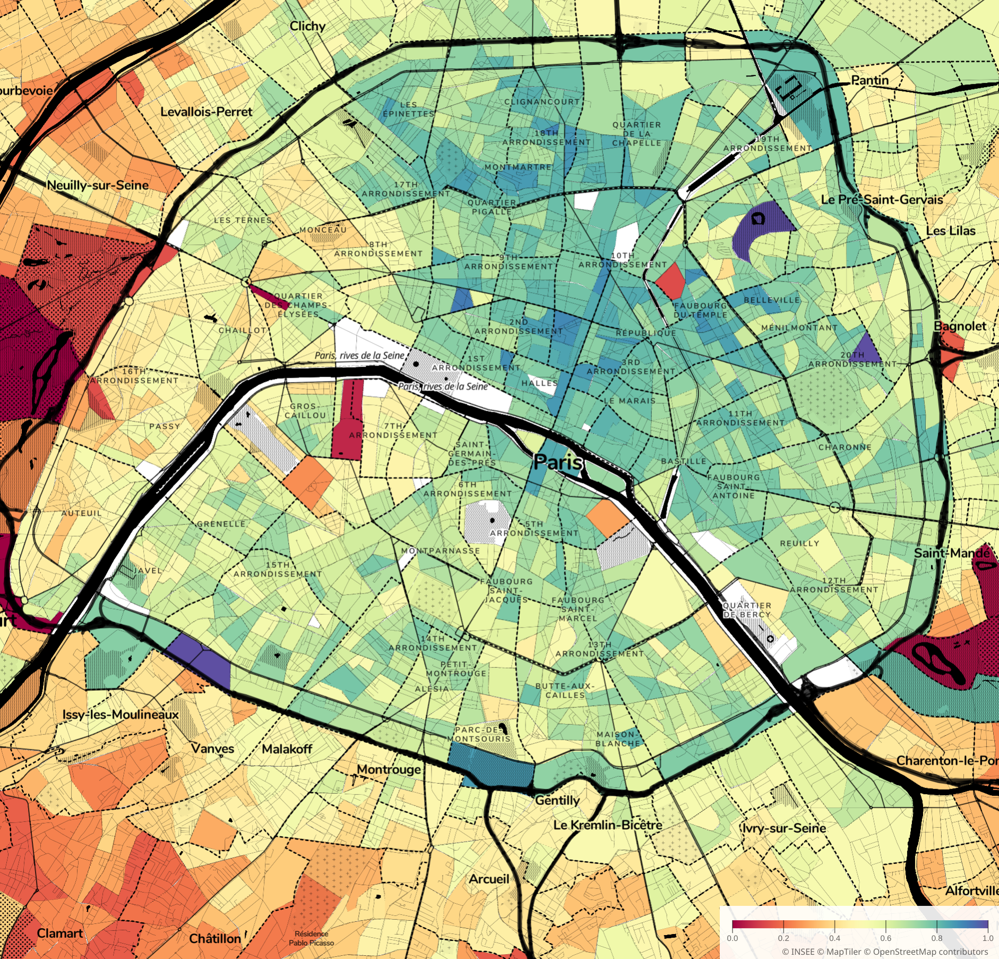

# French IRIS tiled map

[View live here!](https://o.blanthorn.com/france-iris/map/#x=4.844466734284424&y=45.75895982567425&z=13.537551815531074)

A simple data vis tool using MapLibre GL and deck.gl to display data from a CSV file joined with the French INSEE communes

<p align="center">

</p>


# How to run

Prerequisites: yarn. A web browser. A CSV file of IRIS code, value.

0. `git clone`
1. `yarn install`
2. bung data in `./www/data/iris_data.csv` with numeric IRIS code, values normalised from 0-1
3. `yarn serve&; yarn watch`, open localhost:1983
4. reload page to reload data

(nb: at the moment the value column is called perc_voit and the tooltip hardcodes it as percent_zero_voitures)


# Dealing with France

IRIS contour shapefiles come from https://geoservices.ign.fr/contoursiris and then need some wrangling

convert lambert 93 (or other) shapefile with wgs84 geojson then make tiles
```
ogr2ogr -f GeoJSON -t_srs EPSG:4326 iris_2020.geojson CONTOURS-IRIS.shp 
tippecanoe -zg --coalesce-smallest-as-needed --no-tile-compression -e tiles iris_2020.geojson # pay attention to min/max zoom in tiles directory and set to right value in deck.gl
```

# Deployment

```
yarn run build
git add www/
git push
# wait a bit
```

# Get more data

https://www.insee.fr/fr/statistiques?geo=IRIS-1

Just make sure you have IRIS tiles that correspond to the data you're using

# Copyright
IRIS tiles copyright INSEE and IGN
